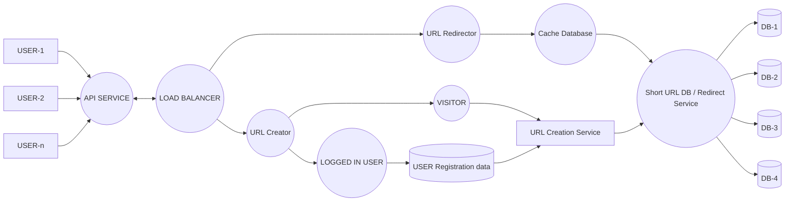

# URL Shortener — System Design

> **Author:** Soumyadeep Paramanick (24BCS10998)

A high-level design for a URL shortening service that converts long URLs into 7-character short links, redirects visitors to the original destination, and keeps registered-user data separate from anonymous visitor traffic.

---

## Table of Contents

1. [Overview](#overview)
2. [Requirements](#requirements)
3. [Load Estimation](#load-estimation)
4. [Short URL Generation](#short-url-generation)
5. [Database Schema](#database-schema)
6. [Architecture](#architecture)
7. [Component Breakdown](#component-breakdown)
8. [Request Flows](#request-flows)
9. [Caching Strategy](#caching-strategy)
10. [Scaling & Sharding](#scaling--sharding)
11. [Future Enhancements](#future-enhancements)

---

## Overview

The service exposes two primary operations:

| Operation | Description | Share of traffic |
|---|---|---|
| **Create** | Accepts a long URL and returns a 7-character short URL | 30% |
| **Redirect** | Resolves a short URL and redirects to the original long URL | 70% |

The system is **read-heavy**, so the design leans on a cache layer in front of the database for the redirect path, while writes go through a dedicated URL creation service.

---

## Requirements

### Functional Requirements

1. **Create Short URL** — generate a short link for any valid long URL.
2. **Login** — authenticate an existing registered user.
3. **SignUp** — register a new user.

### Non-Functional Requirements

1. **Correct redirection** — a short URL must always resolve to its original long URL.
2. **Persist user data** — registration and account details are stored durably.
3. **Link expiry** — short URLs can be given a TTL after which they stop resolving.
4. **Hot-link tracking** — track the most frequently accessed links so they can be cached.
5. **Data separation** — logged-in user data and anonymous visitor data are kept in separate stores/paths.

---

## Load Estimation

**Assumptions**

- Short URL = 7 characters from `[A–Z, a–z, 0–9]` → 62 possible characters per position.
- Daily traffic to the domain ≈ **10 Lakh (1,000,000) requests/day**.
- Split: **30% creation**, **70% redirection**.

**Derived numbers**

| Metric | Calculation | Value |
|---|---|---|
| Total key space | 62⁷ | ≈ **3.5 trillion** unique short URLs |
| Total requests/day | — | 1,000,000 |
| Average QPS | 1,000,000 / 86,400 | ≈ **12 req/sec** |
| Writes (creation) | 30% of 1M | 300,000/day ≈ **3.5 writes/sec** |
| Reads (redirection) | 70% of 1M | 700,000/day ≈ **8.1 reads/sec** |
| Read : Write ratio | 700K : 300K | **~2.3 : 1** |

**Storage estimate**

Assuming ~500 bytes per record (long URL + short URL + metadata):

| Window | Records | Storage |
|---|---|---|
| Per day | 300,000 | ≈ 150 MB |
| Per year | ~109 million | ≈ **54 GB** |
| 5 years | ~547 million | ≈ **270 GB** |

Even at 5 years the dataset stays well within a sharded relational/NoSQL cluster, and the 3.5-trillion key space is nowhere near exhaustion.

---

## Short URL Generation

Each short URL is a 7-character string drawn from a Base62 alphabet:

```
A–Z (26) + a–z (26) + 0–9 (10) = 62 symbols
62^7 = 3,521,614,606,208 combinations
```

**Approach:** use the auto-incrementing `serial_number` as a unique counter and Base62-encode it. This guarantees uniqueness without collision checks, and produces short, non-sequential-looking keys when combined with an offset or bit-scramble.

```
serial_number (INT)  →  Base62 encode  →  shortURL (7 chars)
       125            →      "cb"       →  padded to 7 chars
```

---

## Database Schema

```sql
CREATE TABLE url_mapping (
    serial_number  INT PRIMARY KEY AUTO_INCREMENT,  -- unique counter, drives Base62 key
    longurl        STRING NOT NULL,                 -- original destination URL
    shortURL       STRING NOT NULL UNIQUE           -- 7-char Base62 key
);
```

| Column | Type | Purpose |
|---|---|---|
| `serial_number` | INT | Primary key and source value for Base62 encoding |
| `longurl` | STRING | The original URL supplied by the user |
| `shortURL` | STRING | The generated 7-character key, indexed for fast lookup |

A separate **User Registration** store holds account credentials and profile data for logged-in users, satisfying the "keep user data separate" requirement.

---

## Architecture



---

## Component Breakdown

| Component | Responsibility |
|---|---|
| **Users (1…n)** | Clients issuing create/redirect requests over HTTP. |
| **API Service** | Single public entry point. Handles request validation, authentication tokens, and rate limiting. |
| **Load Balancer** | Distributes incoming traffic across service instances; splits the create path from the redirect path. |
| **URL Creator** | Handles the 30% write traffic. Branches based on whether the caller is a logged-in user or an anonymous visitor. |
| **Logged In User** | Authenticated path — links are associated with an account and persisted against the user's profile. |
| **Visitor** | Anonymous path — links are created without an owner, keeping visitor data isolated from account data. |
| **USER Registration Data** | Durable store for signup/login credentials and user profiles. |
| **URL Creation Service** | Generates the Base62 short key, writes the mapping to the Short URL DB, and applies expiry metadata. |
| **URL Redirector** | Handles the 70% read traffic. Resolves a short key to its long URL and returns an HTTP redirect. |
| **Cache Database** | In-memory layer (e.g. Redis/Memcached) holding the most frequently accessed mappings. |
| **Short URL DB / Redirect Service** | Source of truth for short→long mappings; fronts the sharded database cluster. |
| **DB-1 … DB-4** | Sharded and replicated database nodes storing the URL mapping table. |

---

## Request Flows

### 1. Create a Short URL

```
User → API Service → Load Balancer → URL Creator
                                        ├── Logged In User → User Registration Data
                                        └── Visitor
                                                 ↓
                                      URL Creation Service
                                                 ↓
                                  Short URL DB (write) → DB shards
                                                 ↓
                                    return 7-char short URL
```

1. Client submits a long URL.
2. API Service validates the URL and the auth token (if present).
3. Load Balancer routes to a **URL Creator** instance.
4. The request is classified as **logged-in** or **visitor**; logged-in requests are linked to the user record.
5. **URL Creation Service** allocates the next `serial_number`, Base62-encodes it, and persists `(serial_number, longurl, shortURL)`.
6. The short URL is returned to the client.

### 2. Redirect a Short URL

```
User → API Service → Load Balancer → URL Redirector
                                          ↓
                                    Cache Database
                                    ├── HIT  → return long URL (301/302)
                                    └── MISS → Short URL DB → DB shard
                                                   ↓ populate cache
                                              return long URL
```

1. Client requests `domain.com/{shortURL}`.
2. Load Balancer routes to a **URL Redirector** instance.
3. The redirector checks the **Cache Database** first.
4. On a **hit**, the long URL is returned immediately.
5. On a **miss**, the Short URL DB is queried, the result is written back to the cache, and the redirect is issued.
6. Expired links return `410 Gone` / `404 Not Found` instead of redirecting.

### 3. Login / SignUp

```
User → API Service → Load Balancer → URL Creator (auth branch)
                                          ↓
                             USER Registration Data (read/write)
```

---

## Caching Strategy

- **Why:** redirection is 70% of all traffic and is latency-sensitive — a cache hit avoids a disk read entirely.
- **What to cache:** the most frequently accessed short→long mappings (directly satisfies non-functional requirement #4).
- **Eviction policy:** **LRU** (Least Recently Used), so hot links stay resident and cold links age out.
- **Invalidation:** entries are evicted when a link expires or its mapping is deleted.
- **TTL:** cache entries carry a TTL no longer than the link's own expiry.

Following the classic 80/20 access pattern, caching roughly 20% of the links should serve the large majority of redirect requests.

---

## Scaling & Sharding

**Horizontal scaling**

- API Service, URL Creator, and URL Redirector are stateless → scale out behind the load balancer.
- Read and write paths scale independently, matching the 70/30 traffic split.

**Database sharding**

The diagram shows the Short URL DB fanning out to four database nodes. Two common strategies:

| Strategy | How it works | Trade-off |
|---|---|---|
| **Range-based** | Partition by `serial_number` ranges | Simple, but can create hotspots on the newest shard |
| **Hash-based** | `hash(shortURL) % N` selects the shard | Even distribution; resharding is more involved |

**Replication** — each shard is replicated (primary + replica) so redirect reads can be served from replicas while writes go to the primary, and node failure doesn't lose data.

---

## Future Enhancements

- **Analytics** — click counts, referrers, geography, and device breakdown per link.
- **Custom aliases** — let users pick their own short key instead of the generated one.
- **Rate limiting** — per-IP and per-account throttling to prevent abuse and spam link generation.
- **Malicious URL scanning** — check submitted URLs against a safe-browsing blocklist before shortening.
- **QR code generation** — return a QR code alongside every short URL.
- **Bulk API** — batch endpoint for creating many short URLs in one call.
- **Cleanup job** — background worker that purges expired links and recycles their keys.
