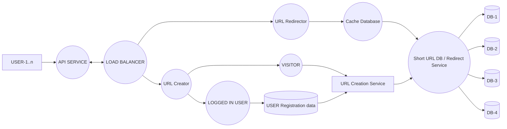

# URL Shortener — System Design

**Soumyadeep Paramanick (24BCS10998)**

Converts long URLs into 7-character short links and redirects visitors back to the original destination. Read-heavy by design, so a cache sits in front of the database on the redirect path.

## Requirements

**Functional:** create short URL, login, signup.

**Non-functional:** correct redirection, durable user data, link expiry, tracking of frequently accessed links, and separation of logged-in user data from anonymous visitor data.

## Load Estimation

- Short URL = 7 chars from `[A-Z, a-z, 0-9]` → 62⁷ ≈ **3.5 trillion** keys
- ~10 Lakh (1M) requests/day → **~12 QPS**
- 30% creation (~3.5 writes/sec), 70% redirection (~8.1 reads/sec)
- ~500 bytes/record → **~150 MB/day, ~54 GB/year**

## Database Schema

```sql
CREATE TABLE url_mapping (
    serial_number  INT PRIMARY KEY AUTO_INCREMENT,
    longurl        STRING NOT NULL,
    shortURL       STRING NOT NULL UNIQUE
);
```

`serial_number` is Base62-encoded to produce `shortURL`, which guarantees uniqueness without collision checks. A separate store holds user registration data.

## Architecture



| Component | Responsibility |
|---|---|
| API Service | Public entry point — validation, auth, rate limiting |
| Load Balancer | Splits traffic across the create and redirect paths |
| URL Creator | Write path; branches into logged-in vs. visitor |
| URL Creation Service | Generates the Base62 key and persists the mapping |
| URL Redirector | Read path; resolves short key to long URL |
| Cache Database | LRU cache of the hottest mappings |
| Short URL DB | Source of truth, fronting the sharded cluster |
| DB-1…DB-4 | Sharded + replicated storage nodes |

## Request Flows

**Create:** client submits a long URL → API validates → Load Balancer routes to URL Creator → request classified as logged-in (linked to account) or visitor → URL Creation Service allocates the next `serial_number`, Base62-encodes it, and writes the mapping → short URL returned.

**Redirect:** client hits `domain.com/{shortURL}` → URL Redirector checks the cache → on a hit, return the long URL immediately; on a miss, query the DB, populate the cache, then redirect. Expired links return 410/404 instead.

## Caching & Scaling

Redirection is 70% of traffic and latency-sensitive, so the hottest mappings are held in memory with **LRU** eviction; entries are invalidated when a link expires. Caching roughly the top 20% of links should serve most redirect traffic.

The API, Creator, and Redirector are stateless and scale out horizontally, letting the read and write paths scale independently. The database is sharded either by `serial_number` range (simple, but hotspots on the newest shard) or by `hash(shortURL) % N` (even distribution, harder to reshard), with each shard replicated so reads can be served from replicas.

## Future Enhancements

Click analytics, custom aliases, per-IP rate limiting, malicious URL scanning, QR code generation, and a background job to purge expired links.

